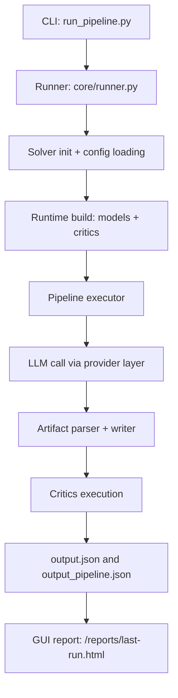

# spec2code: LLM-to-C Pipeline for Safety-Critical Code Generation

`spec2code` generates C implementations from structured requirements and evaluates them using compile checks, formal verification, and non-functional critics.


## Research Basis

This repository is based on the methodology from:

- **Generating Safety-Critical Automotive C-programs using LLMs with Formal Verification** (NeSy 2025)
- OpenReview: `https://openreview.net/forum?id=xcLrUIeGo3`

**This codebase includes a shutdown-algorithm use case based on** [**An Empirical Study of the Code Generation of Safety-Critical Software Using LLMs (Applied Sciences 2024)**](https://www.mdpi.com/2076-3417/14/3/1046).

Suggested citation (paper):

```bibtex
@inproceedings{sevenhuijsen2025safetycritical,
  title={Generating Safety-Critical Automotive C-programs using LLMs with Formal Verification},
  author={Sevenhuijsen, Merlijn and Patil, Minal Suresh and Nyberg, Mattias and Ung, Gustav},
  year={2025},
  url={https://openreview.net/forum?id=xcLrUIeGo3}
}
```

Reference paper for the shutdown-algorithm use case:

```bibtex
@article{liu2024empirical,
  title={An Empirical Study of the Code Generation of Safety-Critical Software Using LLMs},
  author={Liu, Mingxing and Wang, Junfeng and Lin, Tao and Ma, Quan and Fang, Zhiyang and Wu, Yanqun},
  journal={Applied Sciences},
  volume={14},
  number={3},
  pages={1046},
  year={2024},
  doi={10.3390/app14031046},
  url={https://www.mdpi.com/2076-3417/14/3/1046}
}
```

## License and Usage Restriction

- This project is released under a **non-commercial license**.
- Commercial use is **not allowed** without written permission.
- See `LICENSE` for full terms.

## How the Code Works

High-level pipeline flow:

1. CLI entrypoint parses args: `src/spec2code/cli/run_pipeline.py`
2. Orchestrator builds runtime and executes configs: `src/spec2code/core/runner.py`
3. Config parser validates JSON experiment files: `src/spec2code/pipeline_modules/config_loader.py`
4. Prompt inputs are assembled from specs/interfaces/headers.
5. LLMs are called through provider abstraction: `src/spec2code/pipeline_modules/llms.py`
6. Artifacts are parsed/written and critics are run: `src/spec2code/core/artifacts.py`
7. Per-sample and run-level JSON outputs are stored in the configured output folder.
8. HTML report is generated at `<SPEC2CODE_OUTPUT_ROOT>/reports/last-run.html`.



For a deeper component walkthrough, see `docs/ARCHITECTURE.md`.

## Docker-First Setup (Recommended)

This project is designed to run cleanly inside Docker.

### 1) Install Docker

- macOS / Windows: Docker Desktop
- Linux: Docker Engine + Docker CLI

Official install docs:

- `https://docs.docker.com/get-docker/`

### 2) Build the image

From repository root:

```bash
docker build -f dockerfile -t spec2code:local .
```

This build includes Vernfr (`tools/nfrcheck`) by default.

Apple Silicon (M1/M2/M3) notes:

- Native build (recommended):

```bash
docker build --platform linux/arm64 -f dockerfile -t spec2code:local .
```

- If you explicitly need x86_64 behavior/tools:

```bash
docker build --platform linux/amd64 -f dockerfile -t spec2code:local .
```

Optional (only if you need Bedrock CLI commands in-container):

```bash
docker build -f dockerfile --build-arg INSTALL_AWSCLI=1 -t spec2code:local .
```

Optional (skip Vernfr build when troubleshooting image setup):

```bash
docker build -f dockerfile --build-arg BUILD_NFRCHECK=0 -t spec2code:local .
```

### 3) Run container with project mounted

```bash
docker run --rm -it -v "$(pwd)":/workspace spec2code:local bash
```

If you built `linux/amd64` on Apple Silicon, run with matching platform:

```bash
docker run --rm -it --platform linux/amd64 -v "$(pwd)":/workspace spec2code:local bash
```

### 4) Run pipeline inside container

```bash
cd /workspace
PYTHONPATH=src python3 -m spec2code.cli.run_pipeline --config config/gui_templates/shutdown-algorithm-template.json
```

Default template config (`config/gui_templates/shutdown-algorithm-template.json`) uses `test-llm-shutdown` (mock model), so it runs without cloud credentials or local Ollama.

## Run With Existing Container

If a container is already running:

```bash
docker exec -it <container_name_or_id> bash
cd /workspace
PYTHONPATH=src python3 -m spec2code.cli.run_pipeline --config config/gui_templates/shutdown-algorithm-template.json
```

## GUI Runner (MVP)

You can launch a local web UI to run pipeline templates without editing JSON manually:

```bash
PYTHONPATH=src python -m spec2code.gui.run_server --host 127.0.0.1 --port 8080
```

If running from inside Docker, publish the port and bind to all interfaces:

```bash
docker run --rm -it -p 8080:8080 -v "$(pwd)":/workspace spec2code:local bash
cd /workspace
PYTHONPATH=src python -m spec2code.gui.run_server --host 0.0.0.0 --port 8080
```

Then open:

- `http://127.0.0.1:8080/runner`
- `http://127.0.0.1:8080/results`

The UI provides:

- `/runner` page: template mode and custom JSON mode
- `/results` page: embedded latest report and quick analytics (bar/pie charts)
- theme options (Indigo/Monokai/Sunrise/Slate)
- run logs and warning hints (e.g., missing Why3)

By default, GUI/runtime outputs are written outside the repository to:

- `../spec2code_output` (resolved from repo root)

By default, case study assets are also loaded from outside the repository:

- `../spec2code_case_studies` (resolved from repo root)

Override this location with:

```bash
export SPEC2CODE_OUTPUT_ROOT=/absolute/path/to/spec2code_output
export SPEC2CODE_CASE_STUDIES_ROOT=/absolute/path/to/spec2code_case_studies
```

GUI template files are read from:

- `config/gui_templates/`

Temporary JSON files created by GUI runs are stored under:

- `<SPEC2CODE_OUTPUT_ROOT>/gui_tmp/`

## LLM Provider Architecture

Provider-based design (not tied to AWS):

- `ollama` for local models
- `openai-compatible` for vLLM and compatible APIs
- optional `bedrock`

Config file:

- `config/llm_providers.yaml`

Override config location:

```bash
export SPEC2CODE_LLM_CONFIG=/path/to/llm_providers.yaml
```

## Add Another LLM

1. Add (or reuse) a provider in `config/llm_providers.yaml`.
2. Add a model under `models:`.
3. Use that model key in `llms_used` in your run config JSON.

Example:

```yaml
providers:
  my_vllm:
    type: openai-compatible
    base_url: http://localhost:8000/v1
    api_key_env: VLLM_API_KEY

models:
  my-vllm-model:
    provider: my_vllm
    model: Qwen/Qwen2.5-Coder-7B-Instruct
    max_tokens: 2048
```

Then in pipeline config:

```json
"llms_used": ["my-vllm-model"]
```

## Configuration Model

Pipeline configs are JSON arrays (multiple runs per file).

Key fields:

- `name`, `case_study`, `selected_prompt_template`
- `llms_used`, `n_programs_generated`, `temperature`
- `natural_spec_path`, `interface_path`, `headers_dir`, `headers_manifest`
- `include_dirs`, `verification_header_path`
- `critics`, `timeout_s`, `framac_wp_timeout_s`, `framac_wp_no_let`

Reference:

- `config/gui_templates/shutdown-algorithm-template.json`

## Supported Use Cases

- `sgmm_full` in `<SPEC2CODE_CASE_STUDIES_ROOT>/sgmm_full`
- `sfld_full` in `<SPEC2CODE_CASE_STUDIES_ROOT>/sfld_full`
- `shutdown_algorithm` in `<SPEC2CODE_CASE_STUDIES_ROOT>/shutdown_algorithm` (based on [Liu et al., 2024](https://www.mdpi.com/2076-3417/14/3/1046))

Run the shutdown algorithm use case:

```bash
PYTHONPATH=src python -m spec2code.cli.run_pipeline --config config/gui_templates/shutdown-algorithm-template.json
```

## Critics

Configurable critics:

- `compile`
- `framac-wp`
- `cppcheck-misra`
- `vernfr-control-flow`
- `vernfr-data-flow`

Vernfr support is built from `tools/nfrcheck` as part of the Docker image build.
If you run without Docker, make sure the scripts in `tools/nfrcheck/scripts/` are available and executable.

Implementation entrypoint:

- `src/spec2code/pipeline_modules/critics/critics_runner.py`

## Outputs

- Per sample: `<output_folder>/<llm>/sample_000/output.json`
- Run summary: `<output_folder>/output_pipeline.json`
- Report page: `<SPEC2CODE_OUTPUT_ROOT>/reports/last-run.html`

## Extending Features

For adding providers, critics, prompt templates, parser formats, and pipeline features:

- `docs/EXTENDING.md`
- `docs/ADDING_LLMS.md`
- `docs/ADDING_CRITICS.md`
- `docs/ADDING_PROMPTS.md`
- `docs/ADDING_PIPELINE_FEATURES.md`
- `docs/ARCHITECTURE.md`

## Optional: Local Python (Without Docker)

If needed, you can still run locally:

```bash
python3 -m venv .venv
source .venv/bin/activate
pip install -r requirements.txt
PYTHONPATH=src python -m spec2code.cli.run_pipeline --config config/gui_templates/shutdown-algorithm-template.json
```

For Vernfr critics in local (non-Docker) runs, build `tools/nfrcheck` first:

```bash
eval "$(opam env --switch=ocaml5)"
cd tools/nfrcheck
dune build @install
dune install
```
